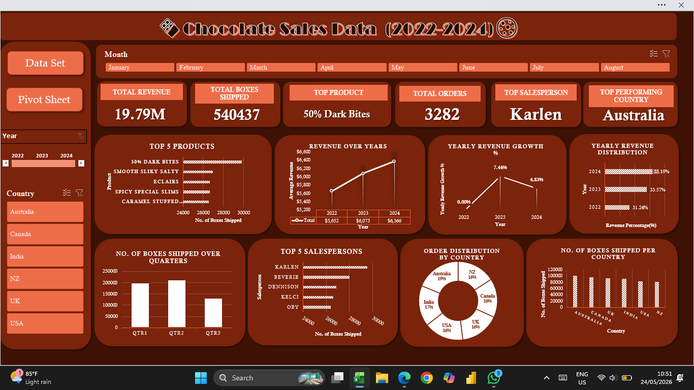

# 🍫 Chocolate Sales Performance Dashboard (Excel)

An interactive Microsoft Excel dashboard built to analyze, visualize, and monitor global chocolate sales performance across multiple countries, products, and sales representatives.

This project demonstrates an end-to-end Excel analytics workflow — transforming raw transactional data into a clean, structured, and interactive business intelligence dashboard through data cleaning, transformation, Pivot Table modeling, KPI engineering, and dashboard UI/UX design.

---

# 📊 Dashboard Preview



---

# 📌 Business Problem

The objective of this project was to develop an interactive reporting solution capable of:

- Monitoring overall sales performance
- Identifying top-performing products and regions
- Tracking shipment trends over time
- Evaluating salesperson contributions
- Enabling quick executive-level business insights through dynamic filtering

---

# 🚀 Key Features & Dashboard Functionality

## 📈 KPI Monitoring

The dashboard dynamically tracks key business metrics including:

- **Total Revenue:** `$19.79M`
- **Total Boxes Shipped:** `540K+`
- **Top Performing Product**
- **Top Performing Salesperson**

---

## 🎛️ Interactive Slicers

Implemented dynamic Excel slicers allowing users to instantly filter dashboard insights by:

- **Year (2022–2024)**
- **Product Category**

This enables focused regional and product-level analysis in real time.

---

## 🌍 Regional Sales Insights

Analyzes performance across multiple international markets including:

- Australia
- Canada
- India
- New Zealand
- United Kingdom
- United States

The dashboard highlights regional revenue contribution and shipment distribution patterns.

---

## 🏆 Product & Salesperson Analysis

Integrated ranking visualizations to identify:

- Best-performing chocolate products
- Highest revenue-generating sales representatives
- Shipment contribution by salesperson

Products such as:

- *Smooth Silky Salty*
- *Raspberry Choco*
- *Milk Choco*

emerged as top-performing categories.

---

# 🛠️ Data Cleaning & Engineering Process

Raw datasets are rarely analysis-ready. To improve data quality, readability, and dashboard responsiveness, several transformation techniques were applied directly within Microsoft Excel.

---

## 1️⃣ Primary Key Creation (`Order_ID`)

Manually engineered a unique sequential `Order_ID` column to:

- Maintain row-level data integrity
- Ensure reliable aggregation
- Prevent duplicate ambiguity during Pivot Table modeling

---

## 2️⃣ Date Transformation (`Text to Columns`)

Used Excel’s **Text-to-Columns** feature to extract raw month numbers from date fields.

The numeric month values were then manually mapped and replaced with full month names such as:

- January
- February
- March

This significantly improved:

- Time-series readability
- Dashboard interpretability
- Chart presentation quality

---

## 3️⃣ String Manipulation (`Flash Fill`)

Utilized Excel’s **Flash Fill** feature to extract only the first names of sales representatives from full-name strings.

This optimization:

- Reduced label clutter
- Improved chart readability
- Created cleaner leaderboard visualizations

---

## 4️⃣ Pivot Table Data Modeling

Built structured intermediate Pivot Tables and Pivot Charts to:

- Aggregate transactional records
- Power dashboard visualizations
- Create dynamic slicer-connected reporting architecture

---

# 📈 Dashboard Design & Data Visualization Principles Applied

## ✅ Visual Hierarchy

Strategically positioned KPI cards at the top of the dashboard to immediately surface high-priority business metrics.

---

## ✅ Clutter Reduction

Removed:

- Gridlines
- Unnecessary chart borders
- Default Pivot field buttons

to create a cleaner, modern BI-style interface.

---

## ✅ Consistent Theme & Branding

Applied a professional dark-themed color palette inspired by premium chocolate branding to improve:

- Visual consistency
- Readability
- Dashboard aesthetics

---

## ✅ Readability Optimization

Used:

- Flash Fill name shortening
- Proper spacing
- Clean typography
- Balanced chart sizing

to maximize information clarity without overcrowding the dashboard.

---

# 💡 Strategic Business Insights Discovered

## 🌟 Top Performing Market

Australia emerged as the strongest-performing region with:

- **$3.65M+ revenue**
- **99K+ boxes shipped**

making it the largest contributor to overall sales performance.

---

## 🍫 Product Performance Trends

Premium and specialty chocolate products significantly outperformed standard variants, indicating strong consumer preference for gourmet flavor profiles.

Top-performing products included:

- Smooth Silky Salty
- Raspberry Choco
- Milk Choco

---

## 📦 Stable Year-Over-Year Growth

Sales and shipment trends demonstrated consistent growth from:

- 2022
- 2023
- 2024

suggesting stable market expansion and healthy business performance across global regions.

---

# 🧰 Excel Skills & Features Demonstrated

- Pivot Tables
- Pivot Charts
- Excel Slicers
- KPI Card Design
- Dashboard UI/UX Design
- Flash Fill
- Text-to-Columns
- Data Cleaning
- Data Transformation
- Time-Series Analysis
- Business Intelligence Reporting
- Interactive Dashboard Development

---

# 💻 Tools & Technologies Used

| Tool | Purpose |
|---|---|
| Microsoft Excel | Data cleaning, transformation, modeling, and dashboard creation |
| Pivot Tables | Data aggregation and analysis |
| Pivot Charts | Dynamic visualization |
| Excel Slicers | Interactive dashboard filtering |
| Flash Fill | String transformation and readability optimization |

---

# 📚 Dataset Source

This project uses the publicly available Chocolate Sales dataset from Kaggle:

- [Chocolate Sales Dataset on Kaggle](https://www.kaggle.com/datasets/saidaminsaidaxmadov/chocolate-sales)

The dataset contains transactional chocolate sales records including:

- Salesperson
- Country
- Product
- Date
- Revenue
- Boxes Shipped

The dataset was cleaned, transformed, and modeled entirely within Microsoft Excel for dashboard development and business insight generation.

---

# 📂 Project Structure

```text
📁 Chocolate-Sales-Dashboard
│
├── CS3.xlsx
├── image_4711c8.png
└── README.md
```

---

# 📄 Files Included

| File | Description |
|---|---|
| `CS3.xlsx` | Main Excel workbook containing raw data, transformations, Pivot Tables, and final dashboard |
| `image_4711c8.png` | Dashboard preview screenshot |
| `README.md` | Project documentation |

---

# 🚀 How to Use the Dashboard

1. Download or clone this repository.
2. Open the `CS3.xlsx` workbook using Microsoft Excel.
3. Enable editing/content if prompted.
4. Use the slicers to dynamically filter and explore sales insights.

> Recommended: Microsoft Excel 2019 or later for full slicer compatibility.

---

# 🎯 Project Objective

The primary goal of this project was to simulate a real-world business intelligence workflow entirely within Microsoft Excel while emphasizing:

- Interactive reporting
- Data storytelling
- Executive dashboard design
- Analytical thinking
- Data visualization best practices

---

# 📌 Author

### Hansani Nawarathna

Aspiring Data Analyst | Excel Dashboard Developer | UI/UX Enthusiast
